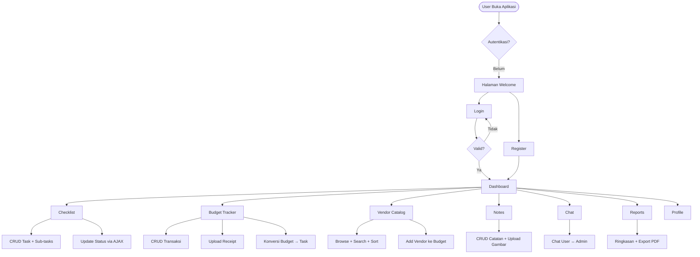
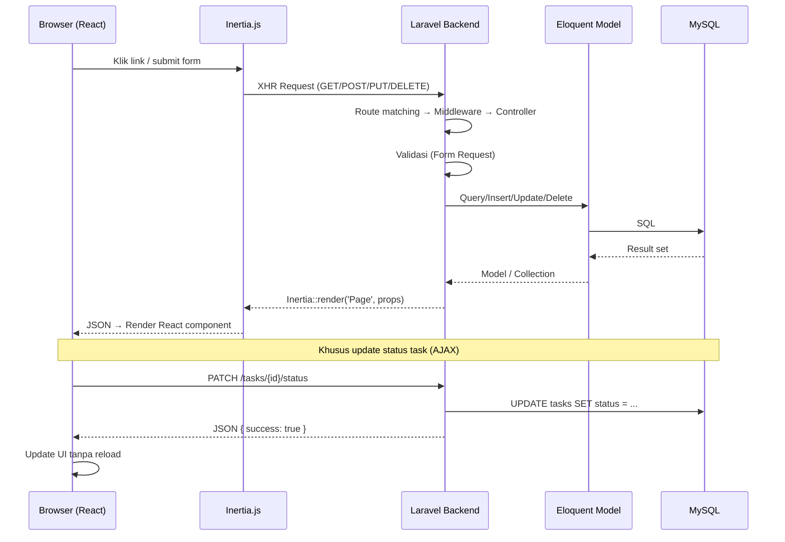

# Bab 2 — Desain Sistem

## 2.1 Arsitektur Aplikasi

My Wedding Planner menggunakan arsitektur **monolithic SPA** dengan Inertia.js sebagai jembatan antara backend Laravel dan frontend React. Pola ini dipilih karena menghilangkan kebutuhan REST API terpisah sambil tetap memberikan pengalaman *single-page application* yang responsif (Inertia.js Documentation, 2024).

```
┌──────────────────────────────────────────────────────┐
│                    BROWSER                            │
│  ┌────────────────────────────────────────────────┐  │
│  │           React 19 + Inertia.js                 │  │
│  │  Layouts (2) │ Pages (37) │ Components (12)    │  │
│  │  Tailwind CSS v4 + shadcn/ui + Chart.js        │  │
│  └────────────────────┬───────────────────────────┘  │
│                       │ XHR (JSON)                    │
└───────────────────────┼──────────────────────────────┘
                        │
┌───────────────────────┼──────────────────────────────┐
│               DOCKER (Laravel Sail)                   │
│  ┌────────────────────┴────────────────────────────┐  │
│  │              LARAVEL 13                          │  │
│  │  Routes → Controllers → Form Requests           │  │
│  │  Models (Eloquent ORM) → MySQL 8.4              │  │
│  └─────────────────────────────────────────────────┘  │
└──────────────────────────────────────────────────────┘
```

**Gambar 2.1** — Arsitektur sistem My Wedding Planner

## 2.2 Diagram Alur Sistem



**Gambar 2.2** — Diagram alur sistem (flowchart)

## 2.3 Alur Request Lifecycle



**Gambar 2.3** — Sequence diagram request lifecycle

## 2.4 Struktur Fitur

```
My Wedding Planner
│
├── 🔐 Authentication (Laravel Breeze — session-based)
│   ├── Register dengan field wedding_date & budget
│   ├── Login + Remember me + Logout
│   └── Forgot/Reset password + Email verification
│
├── 📊 Dashboard
│   ├── Countdown hari pernikahan
│   ├── Ringkasan budget (total / spent / planned / sisa)
│   ├── Pie chart budget per kategori + Doughnut chart status task
│   └── 5 deadline terdekat dengan warning ≤ 7 hari
│
├── ✅ Checklist / Tasks
│   ├── CRUD + sub-tasks (expand/collapse, toggle, inline create)
│   ├── Search + filter (kategori, status) + pagination
│   └── Update status via AJAX tanpa reload
│
├── 💰 Budget Tracker
│   ├── CRUD + upload receipt (max 2MB)
│   ├── Search + filter (kategori, bulan) + pagination
│   └── Konversi budget → checklist + auto sub-task template
│
├── 🏪 Vendor Catalog (global)
│   ├── Browse + search + filter + sort by price
│   ├── Add vendor ke budget (user) | CRUD vendor (admin)
│   └── 120 vendor pre-seeded (6 kategori × 20)
│
├── 📝 Notes
│   ├── CRUD + upload gambar (max 2MB)
│   └── Card view + search + pagination
│
├── 💬 Chat (User ↔ Admin)
│   └── Real-time display dengan auto-scroll
│
├── 📈 Reports
│   └── Ringkasan data + Export PDF checklist
│
├── 👤 Profile
│   └── Edit profil + ganti password + hapus akun
│
└── 🛡️ Admin Panel
    ├── Dashboard admin + monitoring plan user
    ├── Kelola data user (CRUD inline via modal)
    └── Export CSV & PDF + Manajemen vendor global
```

**Gambar 2.4** — Struktur fitur aplikasi

## 2.5 Tech Stack

| Layer | Teknologi | Versi |
|---|---|---|
| Environment | Docker / Laravel Sail | latest |
| Backend | Laravel | 13.x |
| Bahasa Backend | PHP | 8.3+ |
| Database | MySQL | 8.4 |
| Frontend Framework | React | 19.x |
| Frontend Bridge | Inertia.js | 2.x |
| CSS Framework | Tailwind CSS | v4 |
| UI Components | shadcn/ui | latest |
| Charts | Chart.js + react-chartjs-2 | 4.x / 5.x |
| Auth | Laravel Breeze (React + Inertia) | 2.x |
| PDF Export | barryvdh/laravel-dompdf | 3.x |

Pemilihan Laravel sebagai framework didasarkan pada ekosistem yang lengkap (authentication, ORM, migration, validation), sementara Inertia.js dipilih untuk menghindari kompleksitas REST API dan state management terpisah (Stauffer, 2024).
