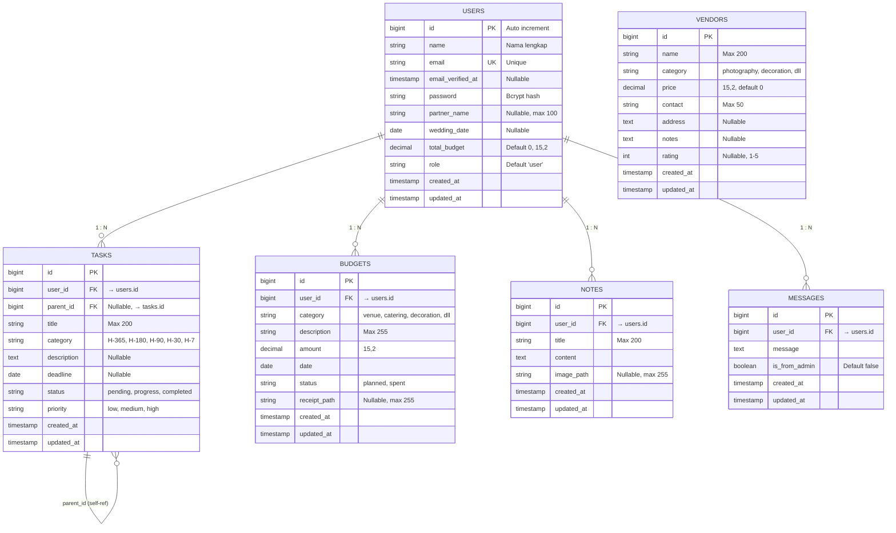

# Bab 3 — Desain Database

## 3.1 Entity Relationship Diagram (ERD)

**Gambar 3.1** — Entity Relationship Diagram (ERD)

## 3.2 Relasi Antar Tabel

| Tabel Induk | Kardinalitas | Tabel Anak | Foreign Key |
|---|---|---|---|
| users | 1 : N | tasks | tasks.user_id |
| users | 1 : N | budgets | budgets.user_id |
| users | 1 : N | notes | notes.user_id |
| users | 1 : N | messages | messages.user_id |
| tasks | 1 : N | tasks | tasks.parent_id |

**Catatan penting:**
- `vendors` bersifat **global** — tidak memiliki `user_id` dan tidak berelasi ke tabel manapun. Vendor dikelola admin sebagai katalog bersama yang dapat diakses semua user.
- Relasi `tasks.parent_id` adalah **self-referencing** yang memungkinkan hierarki task (induk) → sub-task (anak) dengan kedalaman satu level.

## 3.3 Enum Values

Daftar nilai enum yang digunakan dalam aplikasi (divalidasi di level Form Request dan database):

**Tasks:**
- `category`: H-365, H-180, H-90, H-30, H-7 (kategori berdasarkan jarak hari ke pernikahan)
- `status`: pending, progress, completed
- `priority`: low, medium, high

**Budgets:**
- `category`: venue, catering, decoration, photo_video, dress, ring, others
- `status`: planned, spent

**Vendors:**
- `category`: photography, decoration, catering, mua, mc, others

**Users:**
- `role`: user, admin

## 3.4 Daftar Migration

Total terdapat **11 file migration** yang membangun skema database secara bertahap:

| # | Nama File Migration | Operasi |
|---|---|---|
| 1 | `0001_01_01_000000_create_users_table` | Buat tabel users, password_reset_tokens, sessions |
| 2 | `0001_01_01_000001_create_cache_table` | Buat tabel cache, cache_locks |
| 3 | `0001_01_01_000002_create_jobs_table` | Buat tabel jobs, job_batches, failed_jobs |
| 4 | `2026_06_23_110349_add_wedding_fields_to_users_table` | Tambah kolom partner_name, wedding_date, total_budget, role ke users |
| 5 | `2026_06_23_110351_create_tasks_table` | Buat tabel tasks |
| 6 | `2026_06_23_110353_create_budgets_table` | Buat tabel budgets |
| 7 | `2026_06_23_110355_create_vendors_table` | Buat tabel vendors (dengan user_id) |
| 8 | `2026_06_23_110356_create_notes_table` | Buat tabel notes |
| 9 | `2026_06_23_115839_modify_vendors_table` | Hapus user_id + tambah price → vendors jadi global |
| 10 | `2026_06_23_124124_create_messages_table` | Buat tabel messages |
| 11 | `2026_06_23_130629_add_parent_id_to_tasks_table` | Tambah parent_id (self-referencing FK) ke tasks |

> **Tabel 3.1** — Daftar migration dan operasinya

## 3.5 Data Seeder

| Seeder | Jumlah Record | Keterangan |
|---|---|---|
| `UserSeeder` | 21 (1 admin + 20 demo user) | Admin: admin@demo.com, User: user1@demo.com … user20@demo.com |
| `VendorSeeder` | 120 (6 kategori × 20) | Fotografi, dekorasi, katering, MUA, MC, dan lainnya |
| **Total** | **141 record** | |

Semua user demo memiliki password `password`, wedding_date acak antara Jan 2026 – Mei 2027, dan total_budget variatif antara Rp 45–200 juta. Vendor memiliki harga bervariasi dari Rp 500.000 hingga Rp 55.000.000 sesuai kategori.
